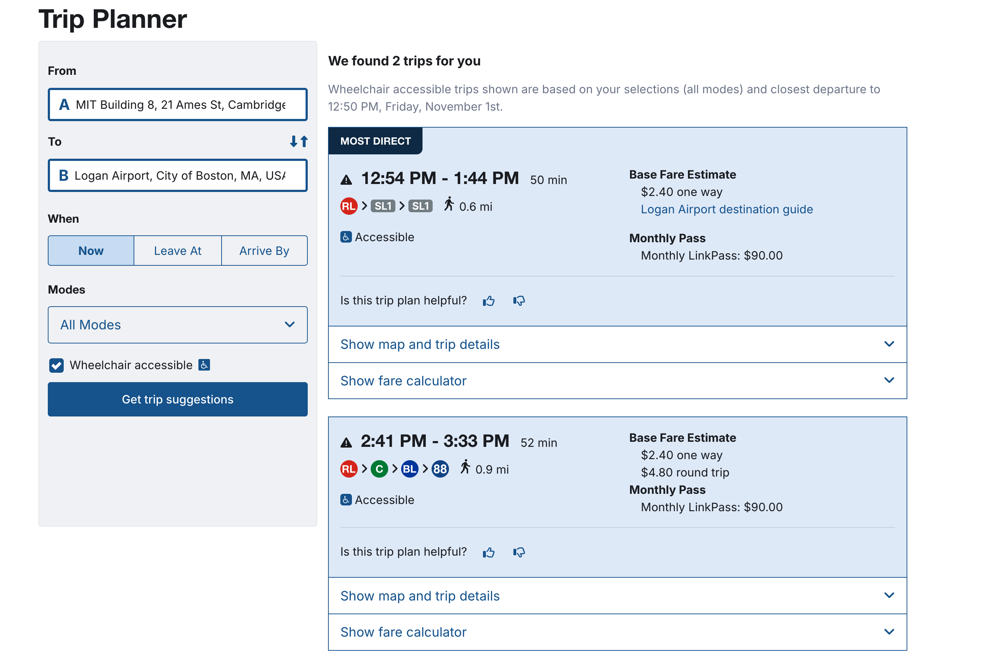
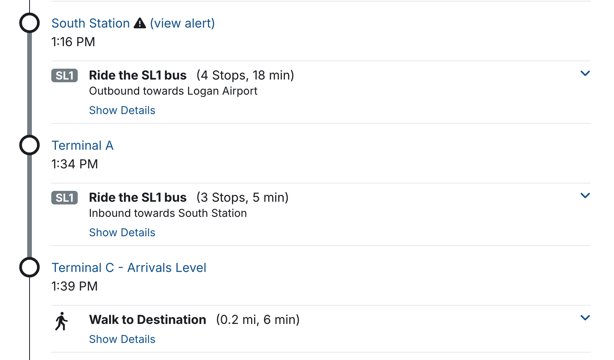
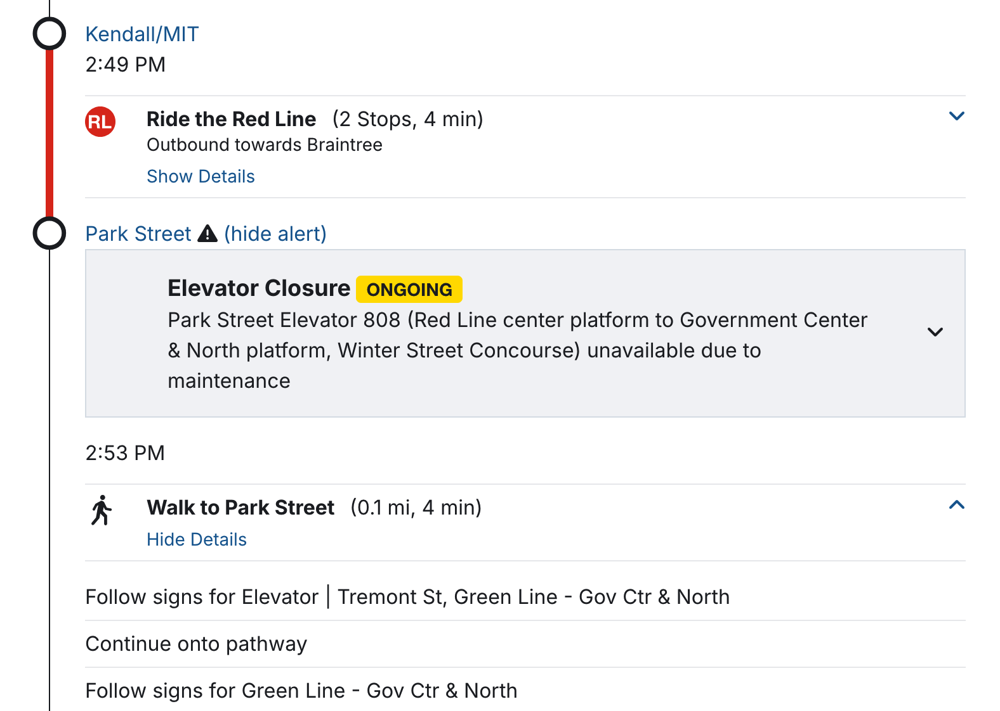
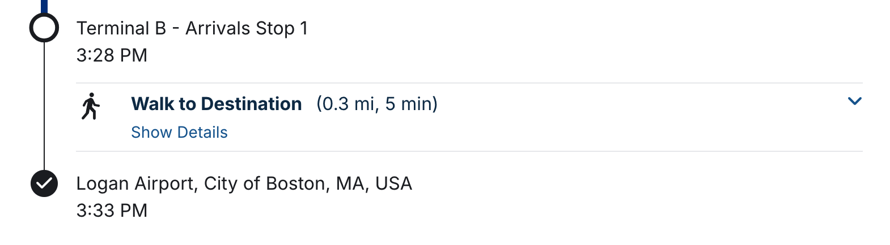

# Assignment 1 - MBTA Trip Planner Memo

> Dustin Michels, 1 Nov 2024, 11.S956 Public Transportation Analytics and Planning

I have investigated the existence of counterproductive or confusing trip suggestions provided by the MBTA trip planner, with special attention given to walking and transfer directions and accessibility concerns.

To do so, I ran a local instance of OpenTripPlanner (OTP) on my machine, based on the configuration provided in the MBTA's [opt-deploy repo](https://github.com/mbta/otp-deploy), and compared the results of a few trip queries to the results provided by the MBTA's trip planner.

## Key recommendations

1. If an elevator closure or other similar issue makes a trip inaccessible, it must not be presented as an accessible route. Providing a collapsible warning is not sufficient.
2. Since the Logan Airport is a common destination, extra care should be taken to make trip planning more clear and ergonomic. This may involve:
   - Ensuring that the Silver Line is presented as a single route, regardless of the terminal you depart at.
   - Improving the geocoding of the airport to provide a more meaningful endpoint.

## Case study: MIT to Logan Airport

One trip that was interrogated goes from MIT to the Logan Airport. The MBTA's transit planner provides two trip suggestions, both of which have some counterintuitive elements.

### Two silver lines

The first trip suggestion involves taking the Red Line from Kendall/MIT to South Station, then transferring to the Silver Line SL1 to the airport. What is strange is that this trip appears to involve _two_ silver lines.

First one rides the silver line to Terminal A, then ostensibly transfers to a different silver line to go to terminal C. In reality, it is the same bus the whole time.

The same issue can be seen in the OTP trip suggestion, which provides some additional detail: the first silver line labeled "SL1 Logan Airport" and the second one is labeled "SL1 South Station."

It seems as soon as the bus reaches terminal A the route changes: it is now headed to South Station instead of to the airport. This makes sense, since passengers leaving the airport from Terminal A would be seeking a bus headed towards South Station. But it creates confusion if you are headed _from_ South Station _to_ Terminal C of the airport, making it appear as if you need to change buses when you don't.

> ✔️ **Suggestion: This trip should be updated to show a single Silver Line route from South Station to the airport, regardless of what terminal you depart at.**

How?

- This confusing result most likely arises from the GTFS data provided by the MBTA. It is not an "error" because once the Silver Line bus has reached terminal A it is indeed headed back to South Station, and passengers need that to be reflected to them. Changing the underlying data to mark Terminal C as the end of the line would create the same issue for passengers leaving the airport from Terminal A.
- Thus, it would be preferable to code an exception into the MBTA app, downstream of the underlying data, which detects this specific issue and presents the Silver Line as a single route to the airport, regardless of the terminal you depart at.

### Park street transfer

For the second suggested trip, one thing that is notable is an alert for the Park Street station which, when toggled open, reveals the elevator is broken.

Seemingly, the expectation is for a wheelchair user to notice the warning icon, click to open it, read the warning, and infer they can no longer complete this trip _after_ the top of the page clearly states that two "wheelchair accessible trips" were found.

> ✔️ **Suggestion: If this elevator outage really does make the trip inaccessible: this trip should be filtered out of the results entirely.**

How?

- The walking instructions are fairly detailed, telling a user to "follow signs for Elevator | Tremont St," for example. This information likely comes from the `pathways.txt` file within the MBTA's GTFS data. While detailed, there is still some ambiguity as to whether "follow signs for elevator" means an elevator is required for the transfer.
- In order to infer that a trip is no longer accessible due to a broken elevator, more detailed `pathways.txt` info may be required.
- It will also be necessary to audit the mechanism by which service alerts are delivered to determine how they can be tied to station data to filter out inaccessible trips.
- _NOTE_: MBTA developers have already made efforts to increase details about stations presented in the GTFS data, and real-time trip accessibility is already [a stated goal.](https://medium.com/@stephclewis/enriching-our-station-data-in-gtfs-8d03c1583c42)

### Non-meaningful final destination

Both trip suggestions suffer from a minor geocoding issue that makes results less ergonomic. When "Logan Airport" is entered into the MBTA trip planning tool, a pin is dropped on the map that does not represent a meaningful endpoint.

Each trip suggestion directs you to a terminal (B or C) and then instructs you to walk to the final destination (0.2 or 0.3 miles).

In reality, someone using the MBTA trip planner is interested in arriving at the closest transit stop to their terminal, so the bus stop should be considered the final destination.

> ✔️ **Suggestion: One solution would be to allow a user to specify a terminal in the search (A, B, or C) and perhaps default to terminal A if none is specified. This would eliminate the non-meaningful walk directions provided after the bus has already reached the airport, which only direct the user to an arbitrary pin.**

How?

- This issue is at the level of the app's geocoding service, which is likely distinct from the underlying OSM data. An audit is required to determine what service is used to geocode search results.
- If possible, a fix can be added into that service itself. Otherwise, a custom fix should be implemented into the MBTA's planner app to ensure when "logan airport" is searched, a specific terminal is returned rather than an arbitrary pin.

## Additional Recommendations

Efforts are already underway that pertain to these concerns.

- The MBTA's efforts to [enrich station data](https://medium.com/@stephclewis/enriching-our-station-data-in-gtfs-8d03c1583c42) may ultimately make possible the real-time accessibility filtering that is recommended above.
- The MBTA's [proposed changes to GTFS](https://docs.google.com/document/d/1I1WHU0uWFS79acblwLSAlfZGcbVEAN_7q99PlWr1HaY/edit?tab=t.0) may also relate to the airport-specific concerns. For example, the proposal to add `directions.txt` to the GTFS data, while not a direct solution, may help make the problem of the two Silver Lines more clear and easy to address.

While not relevant to the issues highlighted here, another exciting improvement to consider is incorporating GBFS data into the planning app, allowing for trips that make use of bike-share or ride-hailing services to address first/last-mile access.

### In-house app vs. third-party solutions

Maintaining an in-house trip planning app is costly and complicated; thus, it is worth considering redirecting the agency's attention towards co-operating with other providers on tools like Google Maps instead.

However, maintaining an in-house app does allow the MBTA to promote positive user experiences in powerful ways. Two points to consider:

#### (A) Fixes that do not depend on data

Two of the issues highlighted here with Logan Airport directions (the two silver lines, and the non-meaningful destination pin) are _not_ strictly problems with the underlying data. Rather, they are non-optimal results that could be addressed with custom fixes to the tooling that rests atop the underlying data. It is hard to influence how downstream tools present these directions if the MBTA only has control over the underlying data.

#### (B) The needs of the network

While tools like Google Maps will always prioritize the user experience, an in-house tool can balance the needs of an individual user with the needs of the network.

For example, in other trip results studied, the MBTA will sometimes present one trip that requires no transfers as "most direct" and another that requires a transfer as "earliest arrival." Two good options. But what if the transfer station or the line being transferred to are frequently congested? And what if the faster trip is only 1-2 minutes faster?

An in-house app can prioritize the needs of the network by encouraging riders to take the marginally slower but more harmonious trip by staying onboard. Meanwhile, an app like Google Maps may always suggest the faster trip, without consideration of the network's needs.

> ✔️ **Suggestion: For these reasons, it is recommended to continue mantaining an in-house planning app.**

## Appendix: Local OTP configuration notes

Using the MBTA's [opt-deploy repo](https://github.com/mbta/otp-deploy), I was able to run a local instance of OTP. The only change I made to the provided repository was to update the version of OTP used to the 2.6.0 release.

This configuration utilizes OSM data for Massachusetts and Rhode Island, and GTFS data for the MBTA and Massport.

In `build-config.json`, this instance is [configured to pre-generate wheelchair-accessible transfers](https://docs.opentripplanner.org/en/latest/Accessibility/). OTP should calculate an accessible transfer if the default one is found to be inaccessible to wheelchair users.

In `router-config.json`, there is a setting under `routingDefaults > itineraryFilters` to include an [accessibility score](https://docs.opentripplanner.org/en/latest/RouteRequest/#rd_itineraryFilters) (between 0 and 1) for each leg and itinerary. There is also a setting, `removeItinerariesWithSameRoutesAndStops`, which is set to `true` to remove itineraries that are duplicates of others.
