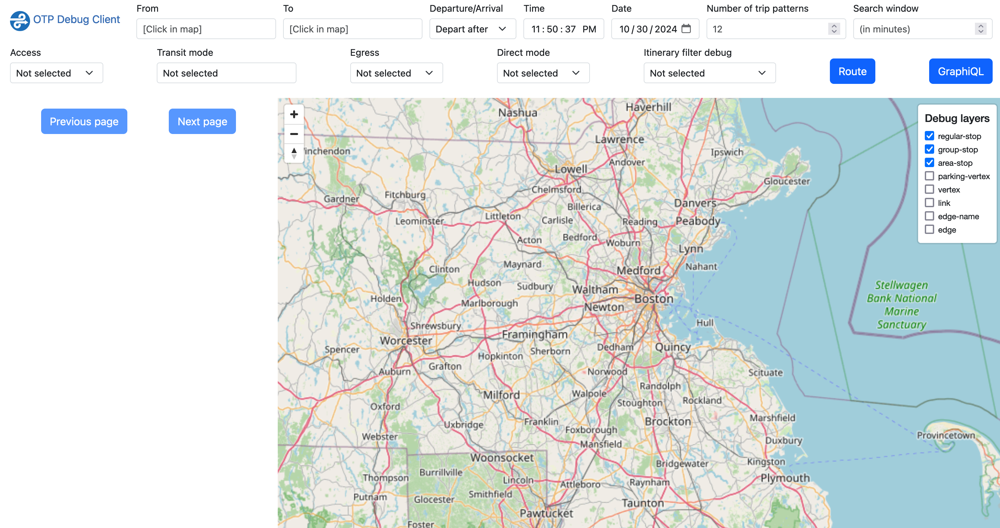

# Setup OTP for MacOS

These instructions are based off the official [OPT Tutorial](https://docs.opentripplanner.org/en/v2.6.0/Basic-Tutorial/) but with additional detail, tailored for MacOS, and updated for Boston area.

## Part 1: Setup OTP

First, we want to setup [OTP](https://github.com/opentripplanner/OpenTripPlanner) (Open Trip Planner) as general tool we can run from the command line.

### [Prerequisite] Install Java

> _"OTP must be run within a Java virtual machine (JVM), which is provided as part of the Java runtime (JRE) or Java development kit (JDK). OTP2 is compatible with Java 21 or later."_ ([OTP Tutorial](https://docs.opentripplanner.org/en/v2.6.0/Basic-Tutorial/))

Check if java is installed by running:

```sh
java -version
```

If multiple versions of java may be installed, you can check which one is active by running:

```sh
which java
```

If the proper version is missing, you can install a few different ways, depending on your setup.

#### Option 1: Homebrew

```sh
brew install openjdk@21
```

- With homebrew, it's easy to install a specific version, but if you have multiple versions installed, takes some extra steps to configure which one is active.

#### Option 2: asdf

Alternatively, [asdf](https://asdf-vm.com/guide/getting-started.html) can be a good tool for installing and managing specific versions of various tools, including Java. Using asdf could look like this:

```sh
# install asdf (if not already installed)
brew install asdf

# install asdf's java plugin (if not already installed)
asdf plugin add java

# install a specific version of java (eg, temurin-21)
asdf install java latest:temurin-21

# set this as the default, system-wide java
asdf global java temurin-21.0.5+11.0.LTS
```

#### Option 3: Manual install

Alternatively, install from [the java website](https://www.java.com/en/download/manual.jsp).

- This might be the easiest way to install, but more challenging to manage, especially if you want other specific versions installed in the future.

### Download OTP

Download the file "otp-2.6.0-shaded.jar" from the [OTP releases page](https://repo1.maven.org/maven2/org/opentripplanner/otp/2.6.0/) and save it to a good directory.

I suggest `~/dev`, which can be a reusable home for other small developer tools.

Via the command line:

```sh
# create directory if it doesn't exist
mkdir -p ~/dev

# enter the directory
cd ~/dev

# download the file from the OTP releases page
wget https://repo1.maven.org/maven2/org/opentripplanner/otp/2.6.0/otp-2.6.0-shaded.jar
```

> 💡 If 'wget' is not installed, you can install it with `brew install wget`.

### [Optional] Create an alias

We will eventually (not yet!) run OTP from the command line with the commands like:

```sh
java -Xmx2G -jar ~/dev/otp-2.6.0-shaded.jar [args]
```

To make things simpler, we can create an "alias" for the first part of the command, allowing us to instead run from anywhere:

```sh
otp [args]
```

For newer versions of MacOS, zsh is the default shell, so aliases will probably live inside a `.zshrc` config file, which should be in your home directory.

> 💡 On older versions of mac this could be in a `.bashrc` or `.bash_profile` file.

From the command line:

```sh
# add alias to zshrc file
echo "alias otp='java -Xmx2G -jar ~/dev/otp-2.6.0-shaded.jar'" >> ~/.zshrc

# re-load file to apply changes
source ~/.zshrc
```

You can also manually open ~/.zshrc in a text editor and add the line `alias otp='java -Xmx2G -jar ~/dev/otp-2.6.0-shaded.jar'` to the end of the file.

> 💡 If you ever run into memory issues, you could try increasing the amount of mem alloted to java by changing `-Xmx2G` to `-Xmx8G`

You should now be able to run the command `otp` from anywhere!

If you try running the command by itself, you should get an error like this saying a parameter is missing:

```sh
otp

> 23:33:31.480 ERROR [main]  (OTPMain.java:93) Parameter error: You must supply a single directory name.
```

This indicates that the alias is working 👍.

## Part 2: Setup local project with Boston data

Next, we want to make a specific project directory with local boston data to run the OTP tool on.

Make a directory for the project, like `~/<CLASS_DIR>/otp` (where `<CLASS_DIR>` is a placeholder for the directory you want to use for this class).

```sh
mkdir -p ~/<CLASS_DIR>/otp
cd ~/<CLASS_DIR>/otp
```

> ⚠️ **We will stay in this directory for the rest of the setup.**

### Option 1: Get data via config file

One way to get data for OTP is to use a config file that specifies the data sources.

- **PRO:** This is super easy.
- **CON:** The files you download by url are large and will make everything slow. If you gather data manually, you can trim it to be smaller and lighter.

Create a file called `build-config.json`

- Here is the one used by in the [MBTA's otp-deploy repo](https://github.com/mbta/otp-deploy/blob/master/var/build-config.json), which we can use as a starting place.
- It includes a few additional configurations, but you can clearly see links to data sources provided under the properties `osm > source` and `transitFeeds > source`.

`build-config.json`

```json
{
  "boardingLocationTags": ["gtfs:stop_id", "ref"],
  "dataImportReport": true,
  "embedRouterConfig": false,
  "osm": [
    {
      "source": "https://download.geofabrik.de/north-america/us/massachusetts-latest.osm.pbf",
      "timeZone": "America/New_York",
      "osmTagMapping": "default"
    },
    {
      "source": "https://download.geofabrik.de/north-america/us/rhode-island-latest.osm.pbf",
      "timeZone": "America/New_York",
      "osmTagMapping": "default"
    }
  ],
  "osmCacheDataInMem": "true",
  "osmDefaults": {
    "timeZone": "America/New_York"
  },
  "transitFeeds": [
    {
      "type": "gtfs",
      "feedId": "massport-ma-us",
      "source": "https://data.trilliumtransit.com/gtfs/massport-ma-us/massport-ma-us.zip"
    },
    {
      "type": "gtfs",
      "feedId": "mbta-ma-us",
      "source": "https://mbta-gtfs-s3.s3.amazonaws.com/google_transit.zip"
    }
  ],
  "transferRequests": [
    {
      "modes": "WALK"
    },
    {
      "modes": "WALK",
      "wheelchairAccessibility": {
        "enabled": true
      }
    }
  ]
}
```

### Option 2: Get data manually

If we gather the data manually, we don't need that config file.

#### GTFS data

Download the GTFS data for the [MBTA website](https://www.mbta.com/developers/gtfs) manually or with wget.

```sh
# make sure we are in the project directory
# Eg, cd ~/<CLASS_DIR>/otp

wget "https://cdn.mbta.com/MBTA_GTFS.zip" -O mbta.gtfs.zip
```

> 💡 Can also get from [transit.land](https://www.transit.land/feeds/f-drt-mbta)

#### OSM data

To get OSM maps from Boston, you have two options:

##### Option 1: protomaps

- Use [protomaps](https://app.protomaps.com/) to draw a square around Boston and download it.
- Rename something like `boston.osm.pbf`.
- Save it to the project folder, eg `~/<CLASS_DIR>/otp`.

##### Option 2: Geofabrik

Alternatively, you can download a larger file of massachusetts using geofabrik and extract the Boston area from it.

We will need a tool called `osmium-tool` to extract the area we want.

```sh
# install the osmium-tool
brew install osmium-tool
```

```sh
# make sure we are in the project directory
# Eg, cd ~/<CLASS_DIR>/otp

# download the massachusetts file from geofabrik
wget https://download.geofabrik.de/north-america/us/massachusetts-200101.osm.pbf

# extract the boston area from the massachusetts file using osmium
osmium extract massachusetts-200101.osm.pbf -b -71.874747,42.210768,-70.769248,42.61885 --strategy=complete_ways -o boston.osm.pbf
```

- Bounding boxes were found with [this tool](https://boundingbox.klokantech.com/). Select the "csv" format for copying.

## Part 3: Run OTP

From the project directory (eg, `~/<CLASS_DIR>/otp`), we can now run the OTP tool with the data we have.

To build and serve in a single step, run the following command:

```sh
otp --build --serve .
```

> 💡 `otp` is an alias for `java -Xmx2G -jar ~/dev/otp-2.6.0-shaded.jar`

If everything works, the trip planner should be running at `http://localhost:8080/`.

The interface should look something like this:



### Build and serve separately

Since building is slow, you can break this up into two steps.

```sh
# build graph
otp --build --save .

# run server
otp --load .
```

### Build street data separately

You can break things down even further by first building the street data, then layering the OSM data on top of that, then running the server.

```sh
# build street graph with OSM data
otp --buildStreet .

# build graph layering transit data onto street data
otp --loadStreet --save .

# run server
otp --load .
```
